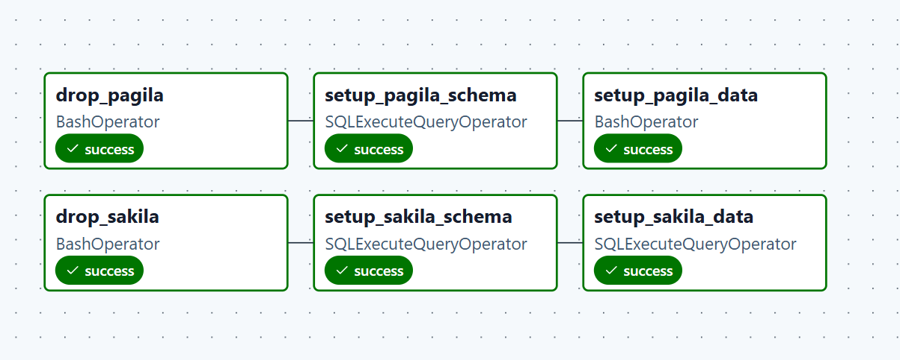
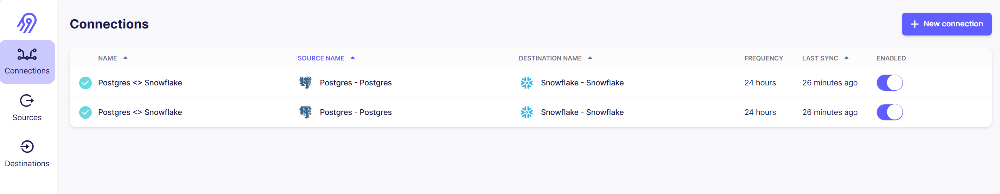
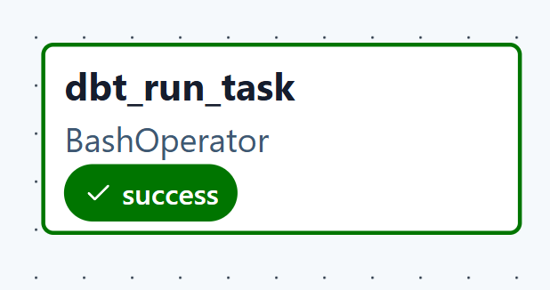
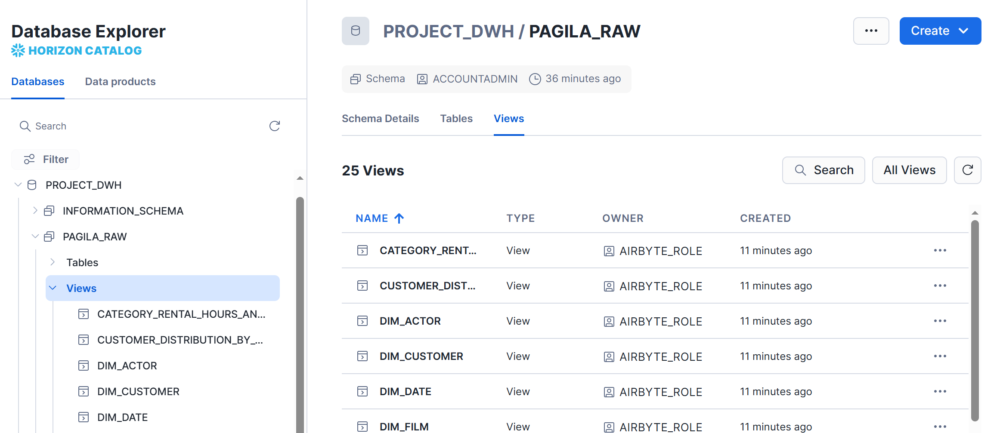

# Data Pipeline (Airflow, Airbyte, dbt, Snowflake)
## Design of DWH,  design of ELT/ETL pipeline
Creation of a multi-layer Cloud DWH (Snowflake) using a Star Schema design, supported by an automated ELT pipeline that orchestrates data ingestion via Airbyte API and manages complex transformations using dbt (Staging, Intermediate, Marts, Analytics) within an Apache Airflow environment.

## 1. You should automate Pagila set up with Apache Airflow. Do the same for Sakila db.

### DAG 1: Setup databases 

## 2. Configure Airbyte and replicate all tables from Pagila and Sakila to Snowflake (separate schemas). Configure development role for Airflow to operate with Snowflake. Admin role should not be used by AIrflow. Implement this configuration change into Airflow and test replication again.

### DAG 2: Airbyte sync

## 3. Configure DBT and Snowflake setup.

### DAG 3: Run dbt

